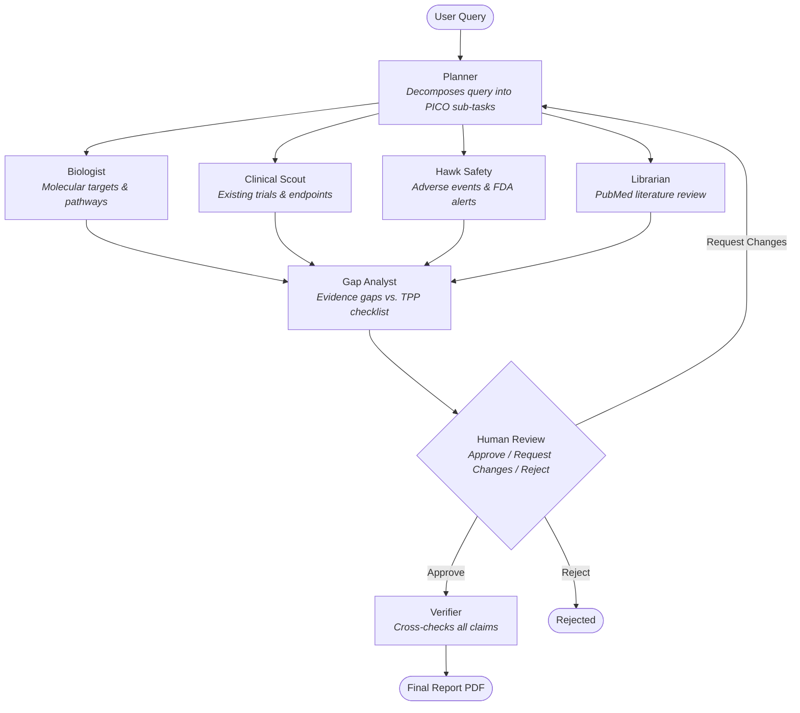

# Entropy

Entropy is an autonomous multi-agent drug-repurposing research platform built on [Mastra](https://mastra.ai) and TypeScript. Given a research query (e.g., "Can metformin be repurposed for Alzheimer's disease?"), it orchestrates a pipeline of 7 specialised AI agents to produce a fully cited HTML/PDF research dossier with a human-in-the-loop (HITL) review step.

## Architecture

The system is a **pnpm monorepo** with 9 workspace packages across three layers:

```
apps/
  mastra-app/     Core pipeline: agents, workflows, schemas, report generator
  api/            Hono REST API + SSE streaming + CopilotKit chat endpoint
  copilot-ui/     Next.js 16 chat-based frontend (React 19, Tailwind v4, framer-motion)
packages/
  mcp-biology/    MCP server: Open Targets, UniProt, Ensembl, NCBI tools
  mcp-clinical/   MCP server: ClinicalTrials.gov, PubMed tools
  mcp-safety/     MCP server: OpenFDA FAERS/labels/recalls, drug interactions
  mcp-commercial/ MCP server: market data, web search (stubs)
  audit/          PostgreSQL-backed audit trail + tool response cache
  telemetry/      OpenTelemetry instrumentation (OTLP/console/memory exporters)
```

Legacy directories (`engine-ts/`, `server/`, `client/`) are earlier prototypes and are not part of the active workspace.

## Research Pipeline

The pipeline is a Mastra workflow defined in `apps/mastra-app/src/workflows/research-pipeline.ts` with the following stages:



### Pipeline Steps

1. **Audit Session** -- Creates a PostgreSQL audit record for provenance tracking
2. **Planner** -- Decomposes the query into a structured PPICO research plan with sub-tasks
3. **Parallel Research** -- 4 domain agents run concurrently (each with `maxSteps: 10`):
   - **Biologist** -- Biological rationale via Open Targets, UniProt, Ensembl, NCBI
   - **Clinical Scout** -- Clinical trial landscape via ClinicalTrials.gov
   - **Hawk (Safety)** -- Drug safety profile via OpenFDA FAERS, labels, recalls
   - **Librarian** -- Literature review via PubMed
4. **Merge Evidence** -- Collates parallel outputs into a unified Evidence object
5. **Gap Analyst** -- Evaluates findings against a 12-item Target Product Profile (TPP) checklist
6. **Human Review (HITL)** -- Suspends the pipeline for a reviewer to approve, request changes, or reject. "Request Changes" triggers an iterative refinement loop back through the pipeline.
7. **Verifier** -- Cross-checks all claims using every MCP tool (`maxSteps: 15`)
8. **Report Generator** -- Produces an HTML preview and compiles a PDF via pandoc + xelatex

### MCP Servers

All MCP servers use the Model Context Protocol over stdio transport:

| Package          | Tools                                                                                                                        | Data Sources                         |
| ---------------- | ---------------------------------------------------------------------------------------------------------------------------- | ------------------------------------ |
| `mcp-biology`    | `search_targets`, `get_target`, `search_diseases`, `get_associations`, `get_protein_data`, `search_uniprot`, `get_gene_info` | Open Targets, UniProt, Ensembl, NCBI |
| `mcp-clinical`   | `search_studies`, `get_study`, `search_literature`, `search_preprints`                                                       | ClinicalTrials.gov, PubMed           |
| `mcp-safety`     | `check_drug_safety`, `check_adverse_events`, `search_drug_labels`, `search_recalls`, `check_interactions`                    | OpenFDA FAERS, DailyMed, DrugBank    |
| `mcp-commercial` | `get_market_data`, `web_search`                                                                                              | Stubs (return `{_stub: true}`)       |

### LLM Configuration

Multi-provider support via `apps/mastra-app/src/lib/llm.ts`:

| Provider                | Env Key                        | Example Model                        |
| ----------------------- | ------------------------------ | ------------------------------------ |
| Google Gemini (default) | `GOOGLE_GENERATIVE_AI_API_KEY` | `google:gemini-2.5-flash`            |
| OpenAI                  | `OPENAI_API_KEY`               | `openai:gpt-4o`                      |
| Anthropic               | `ANTHROPIC_API_KEY`            | `anthropic:claude-sonnet-4-20250514` |
| Perplexity              | `PERPLEXITY_API_KEY`           | `perplexity:sonar-pro`               |
| HuggingFace             | `HUGGINGFACE_API_KEY`          | `huggingface:meta-llama/...`         |
| OpenRouter              | `OPENROUTER_API_KEY`           | `openrouter:google/gemini-flash-1.5` |

Per-agent model overrides via env vars: `PLANNER_MODEL`, `BIOLOGIST_MODEL`, `CLINICAL_SCOUT_MODEL`, `HAWK_SAFETY_MODEL`, `LIBRARIAN_MODEL`, `GAP_ANALYST_MODEL`, `VERIFIER_MODEL`. Built-in exponential backoff for rate limits.

## REST API (`apps/api`)

A [Hono](https://hono.dev) server on port 3001:

| Method | Endpoint                           | Description                                         |
| ------ | ---------------------------------- | --------------------------------------------------- |
| `POST` | `/api/research`                    | Submit a research query, returns session ID         |
| `GET`  | `/api/research/:sessionId`         | Session status and results                          |
| `GET`  | `/api/research/:sessionId/agents`  | Per-agent status                                    |
| `GET`  | `/api/research/:sessionId/stream`  | SSE stream of agent activity events                 |
| `POST` | `/api/research/:sessionId/review`  | Submit HITL review (approve/reject/request changes) |
| `GET`  | `/api/research/:sessionId/report`  | Download compiled PDF report                        |
| `GET`  | `/api/research/:sessionId/preview` | HTML preview of the dossier                         |
| `GET`  | `/api/research/:sessionId/audit`   | Audit trail for a session                           |
| `POST` | `/api/chat`                        | CopilotKit AG-UI chat endpoint                      |
| `GET`  | `/api/health`                      | Health check                                        |

Error responses follow a consistent format:

```json
{
  "error": {
    "code": "NOT_FOUND",
    "message": "Session not found",
    "details": {}
  }
}
```

## Frontend (`apps/copilot-ui`)

A Next.js 16 (App Router) chat-style interface built with React 19, Tailwind CSS v4, and framer-motion:

- Chat-based query submission with example prompts
- Real-time pipeline stages sidebar with SSE activity streaming
- Per-agent status tracking with expandable tool call details
- HITL review panel (approve / request changes / reject) with report preview
- PDF download on completion
- CopilotKit integration for AI-assisted chat
- Dark-only theme with glass-morphism effects
- Session persistence via localStorage

## Getting Started

### Prerequisites

- Node.js 20+
- pnpm 9+
- pandoc + xelatex (for PDF report generation)

```bash
# Ubuntu/Debian
sudo apt install pandoc texlive-xetex

# macOS
brew install pandoc mactex
```

### Installation

```bash
pnpm install
```

### Environment Variables

Copy `.env.example` to `.env` and fill in your API keys:

```bash
cp .env.example .env
```

Key variables:

```bash
GOOGLE_GENERATIVE_AI_API_KEY=   # Gemini (primary LLM) -- required
DATABASE_URL=                   # PostgreSQL for audit trail (optional, degrades gracefully)
OPENAI_API_KEY=                 # Required if using openai: provider
ANTHROPIC_API_KEY=              # Required if using anthropic: provider
```

See `.env.example` for the full list including per-agent model overrides and OpenTelemetry configuration.

### Running

```bash
# Build all packages
pnpm -r build

# Start the API server (port 3001)
pnpm --filter @entropy/api start

# Start the frontend (port 3000)
pnpm --filter copilot-ui dev

# Start the Mastra dev playground
pnpm --filter @entropy/mastra-app dev
```

### Running with Docker

```bash
docker compose up
```

Services:

- `postgres` on port 5432
- `api` on port 3001
- `server` on port 5000 (legacy)
- `client` on port 5173 (legacy)

## Audit & Telemetry

### Audit Trail (`packages/audit`)

PostgreSQL-backed provenance logging with 5 tables:

- `research_sessions` -- Session lifecycle tracking
- `tool_call_logs` -- Every MCP tool invocation with inputs/outputs
- `agent_traces` -- Per-agent execution traces
- `hitl_records` -- Human review decisions and feedback
- `tool_response_cache` -- Response caching with per-tool TTLs

When `DATABASE_URL` is not set, the audit system degrades gracefully to a no-op store.

### Telemetry (`packages/telemetry`)

OpenTelemetry instrumentation with semantic spans for agents, tools, and workflow steps. Supports OTLP, console, and in-memory exporters. Configure via `OTEL_EXPORTER`, `OTEL_EXPORTER_OTLP_ENDPOINT`, and `OTEL_SERVICE_NAME` env vars.

## Testing

Tests use [Vitest](https://vitest.dev). Integration tests are gated behind `RUN_INTEGRATION_TESTS=1`.

```bash
# Run all tests
pnpm -r test

# Run a specific test file
npx vitest run "apps/api/src/__tests__/api.test.ts"

# Run integration tests (requires live APIs + API keys)
RUN_INTEGRATION_TESTS=1 pnpm -r test
```

Test coverage spans all MCP servers, audit/cache stores, all agents, the full pipeline, report generation, API endpoints, and telemetry.

## License

Open-source for research purposes.
