```mermaid
flowchart LR

    %% ================================================================
    %%  ZONE 1 -- USER & FRONTEND
    %% ================================================================
    subgraph ZONE1["PRESENTATION LAYER"]
        direction TB

        USER(["Researcher / Reviewer"])

        subgraph UI["Next.js Copilot UI &ensp; :3000"]
            direction TB
            CHAT["Chat Interface<br/>Natural-language query input"]
            PIPELINE_MON["Pipeline Monitor<br/>Real-time agent status"]
            HITL_UI["HITL Review Panel<br/>Approve / Revise / Reject"]
            REPORT_DL["Report Download<br/>PDF dossier"]
            COPILOT_SIDEBAR["CopilotKit Chat<br/>AG-UI Protocol"]
        end

        USER --> CHAT
        USER --> PIPELINE_MON
        USER --> HITL_UI
        USER --> REPORT_DL
    end

    %% ================================================================
    %%  ZONE 2 -- API GATEWAY
    %% ================================================================
    subgraph ZONE2["API GATEWAY"]
        direction TB

        subgraph HONO["Hono REST Server &ensp; :3001"]
            direction TB
            EP_RESEARCH["POST /research<br/>GET /research/:id<br/>GET /agents"]
            EP_REVIEW["POST /review<br/>GET /preview"]
            EP_REPORT["GET /report<br/>GET /audit"]
        end

        SSE_STREAM["SSE Streaming<br/>GET /stream<br/>Real-time events push"]
        COPILOT_RT["CopilotKit Runtime<br/>AG-UI Adapter<br/>/api/chat"]
        SESSION["Session Store<br/>(in-memory Map)"]
        ABUS["Activity Bus<br/>(EventEmitter pub/sub)"]

        HONO --- SESSION
        SSE_STREAM --- ABUS
    end

    %% ================================================================
    %%  ZONE 3 -- AI ORCHESTRATION ENGINE  (centerpiece)
    %% ================================================================
    subgraph ZONE3["AI ORCHESTRATION ENGINE &ensp; &mdash; &ensp; Mastra Workflow"]
        direction TB

        %% --- Phase 1 ---
        subgraph PHASE1["PHASE 1 &ensp; Planning"]
            PLANNER["Planner Agent<br/>PPICO Decomposition<br/>+ Sub-task Distribution"]
        end

        %% --- Phase 2 ---
        subgraph PHASE2["PHASE 2 &ensp; Parallel Evidence Gathering &ensp; (4 agents simultaneously)"]
            direction LR
            BIO["Biologist<br/>Target validation<br/>Gene-disease links<br/>Protein pathways"]
            CLIN["Clinical Scout<br/>Trial landscape<br/>Study designs<br/>Endpoints & results"]
            HAWK["Hawk Safety<br/>Adverse events<br/>Drug interactions<br/>Recalls & alerts"]
            LIB["Librarian<br/>Published studies<br/>Systematic reviews<br/>Meta-analyses"]
        end

        %% --- Phase 3 ---
        subgraph PHASE3["PHASE 3 &ensp; Analysis & Verification"]
            direction LR
            MERGE["Evidence<br/>Merge<br/>+ Sanitize"]
            GAP["Gap Analyst<br/>12-item TPP<br/>Checklist<br/>Gap severity rating"]
            VERIFIER["Verifier Agent<br/>Re-queries ALL<br/>raw sources<br/>Confidence 0 &ndash; 1"]
        end

        %% --- Phase 4 ---
        subgraph PHASE4["PHASE 4 &ensp; Governance & Output"]
            direction LR
            HITL{"Human-in-the-Loop<br/>Pipeline SUSPENDS<br/>Approve | Revise | Reject"}
            HTML_RENDER["HTML Renderer<br/>Self-contained<br/>preview dossier"]
            PDF_COMPILE["PDF Compiler<br/>Puppeteer<br/>A4 paginated"]
        end

        %% internal orchestration flow
        PLANNER -->|"prioritized<br/>sub-tasks"| BIO & CLIN & HAWK & LIB
        BIO --> MERGE
        CLIN --> MERGE
        HAWK --> MERGE
        LIB --> MERGE
        MERGE -->|"unified<br/>evidence"| GAP
        GAP -->|"gap report<br/>+ risk flags"| VERIFIER
        VERIFIER -->|"verification<br/>report"| HTML_RENDER
        HTML_RENDER --> HITL
        HITL -->|"approved"| PDF_COMPILE
        HITL -.->|"revise &mdash;<br/>re-run verifier"| VERIFIER
    end

    %% ================================================================
    %%  ZONE 4 -- MCP TOOL PROTOCOL LAYER
    %% ================================================================
    subgraph ZONE4["MCP TOOL LAYER &ensp; &mdash; &ensp; Model Context Protocol (stdio)"]
        direction TB
        MCP_BIO["mcp-biology<br/>13 tools<br/>validate_target &bull; get_drug_info<br/>get_disease_info &bull; get_gene_info<br/>get_protein_data &bull; search_uniprot<br/>+ 7 more"]
        MCP_CLIN["mcp-clinical<br/>7 tools<br/>search_studies &bull; get_study_details<br/>get_eligibility &bull; search_literature<br/>search_preprints &bull; get_abstract<br/>get_paper_metadata"]
        MCP_SAFE["mcp-safety<br/>7 tools<br/>check_drug_safety &bull; adverse_events<br/>check_recalls &bull; get_ndc_info<br/>search_drugs_fda &bull; shortages<br/>get_drug_interactions"]
        MCP_COMM["mcp-commercial<br/>3 tools (planned)<br/>search_market_data<br/>competitive_landscape<br/>web_search_sonar"]
    end

    %% ================================================================
    %%  ZONE 5 -- EXTERNAL BIOMEDICAL APIs
    %% ================================================================
    subgraph ZONE5["EXTERNAL BIOMEDICAL DATA SOURCES"]
        direction TB

        subgraph BIO_APIs["Biology APIs"]
            direction LR
            OT[("Open Targets<br/>GraphQL")]
            ENSEMBL[("Ensembl<br/>REST")]
            UNIPROT[("UniProt<br/>REST")]
            NCBI_BIO[("NCBI<br/>E-utilities")]
        end

        subgraph CLIN_APIs["Clinical APIs"]
            direction LR
            CTG[("ClinicalTrials<br/>.gov &ensp; REST")]
            PUBMED[("PubMed<br/>E-utilities")]
        end

        subgraph SAFE_APIs["Safety APIs"]
            direction LR
            FDA[("OpenFDA<br/>FAERS &ensp; REST")]
            RXNAV[("RxNav<br/>REST")]
        end
    end

    %% ================================================================
    %%  ZONE 6 -- LLM PROVIDERS  (below orchestration)
    %% ================================================================
    subgraph ZONE6["LLM PROVIDERS &ensp; (per-agent configurable &bull; multi-provider)"]
        direction LR
        GEMINI["Google Gemini<br/>(primary)"]
        GPT["OpenAI GPT"]
        CLAUDE["Anthropic Claude"]
        SONAR["Perplexity<br/>Sonar Pro"]
        HF["HuggingFace<br/>Open Models"]
        OPENROUTER["OpenRouter<br/>Model Gateway"]
    end

    %% ================================================================
    %%  ZONE 7 -- INFRASTRUCTURE
    %% ================================================================
    subgraph ZONE7["INFRASTRUCTURE &ensp; &mdash; &ensp; Observability, Compliance & Tooling"]
        direction LR
        PG[("PostgreSQL<br/>Audit Trail<br/>5 tables<br/>+ response cache")]
        OTEL["OpenTelemetry<br/>Distributed Tracing<br/>OTLP &bull; Console<br/>&bull; Memory exporters"]
        ZOD["Zod Schemas<br/>Runtime validation<br/>every agent I/O<br/>every tool param"]
        RETRY["Rate-Limit Retry<br/>Exponential backoff<br/>15s base &bull; 6 retries"]
        ALS["AsyncLocalStorage<br/>Session context<br/>propagation"]
    end

    %% ================================================================
    %%  CROSS-ZONE CONNECTIONS
    %% ================================================================

    %% Frontend --> API
    CHAT -->|"POST /research"| EP_RESEARCH
    PIPELINE_MON -->|"SSE subscribe"| SSE_STREAM
    HITL_UI -->|"POST /review"| EP_REVIEW
    REPORT_DL -->|"GET /report"| EP_REPORT
    COPILOT_SIDEBAR -->|"/api/chat"| COPILOT_RT

    %% API --> Orchestration
    EP_RESEARCH ==>|"start workflow"| PLANNER
    EP_REVIEW ==>|"resume workflow"| HITL
    ABUS -.->|"live events"| SSE_STREAM

    %% Orchestration --> MCP  (agent-to-server mapping)
    BIO ==>|"tool calls"| MCP_BIO
    CLIN ==>|"tool calls"| MCP_CLIN
    HAWK ==>|"tool calls"| MCP_SAFE
    LIB ==>|"tool calls"| MCP_CLIN
    VERIFIER -.->|"re-queries<br/>ALL 30+ tools"| MCP_BIO
    VERIFIER -.->|"re-queries"| MCP_CLIN
    VERIFIER -.->|"re-queries"| MCP_SAFE

    %% MCP --> External APIs
    MCP_BIO ==> OT & ENSEMBL & UNIPROT & NCBI_BIO
    MCP_CLIN ==> CTG & PUBMED
    MCP_SAFE ==> FDA & RXNAV

    %% Orchestration --> LLM Providers  (single grouped connection)
    PLANNER -.->|"LLM calls"| GEMINI
    BIO -.-> GEMINI
    CLIN -.-> GEMINI
    HAWK -.-> GEMINI
    LIB -.-> GEMINI
    GAP -.-> GEMINI
    VERIFIER -.->|"LLM call"| GPT

    %% Orchestration --> Infrastructure
    PLANNER -.-> PG
    MERGE -.-> PG
    VERIFIER -.-> PG
    HITL -.-> PG
    PDF_COMPILE -.-> PG
    ZONE3 -.-> OTEL

    %% Report output
    PDF_COMPILE -->|"PDF dossier"| REPORT_DL

    %% ================================================================
    %%  STYLING
    %% ================================================================

    %% Zone colors
    classDef zone1 fill:#1e1b4b,stroke:#818cf8,color:#c7d2fe,font-weight:bold
    classDef zone2 fill:#0c1a3d,stroke:#3b82f6,color:#93c5fd,font-weight:bold
    classDef zone3 fill:#1a0533,stroke:#a855f7,color:#e9d5ff,font-weight:bold
    classDef zone4 fill:#062c3e,stroke:#06b6d4,color:#a5f3fc,font-weight:bold
    classDef zone5 fill:#052e16,stroke:#22c55e,color:#bbf7d0,font-weight:bold
    classDef zone6 fill:#2d1b0e,stroke:#f59e0b,color:#fde68a,font-weight:bold
    classDef zone7 fill:#1c1917,stroke:#78716c,color:#d6d3d1,font-weight:bold

    %% Special node styles
    classDef userNode fill:#6366f1,stroke:#4f46e5,color:#fff,font-weight:bold
    classDef hitlNode fill:#92400e,stroke:#f59e0b,color:#fef3c7,font-weight:bold
    classDef dbNode fill:#064e3b,stroke:#10b981,color:#a7f3d0
    classDef plannedNode fill:#1c1917,stroke:#525252,color:#a3a3a3,stroke-dasharray:5 5

    %% Apply styles
    class USER userNode
    class CHAT,PIPELINE_MON,HITL_UI,REPORT_DL,COPILOT_SIDEBAR zone1
    class EP_RESEARCH,EP_REVIEW,EP_REPORT,SSE_STREAM,COPILOT_RT,SESSION,ABUS zone2
    class PLANNER,BIO,CLIN,HAWK,LIB,MERGE,GAP,VERIFIER,HTML_RENDER,PDF_COMPILE zone3
    class HITL hitlNode
    class MCP_BIO,MCP_CLIN,MCP_SAFE zone4
    class MCP_COMM plannedNode
    class OT,ENSEMBL,UNIPROT,NCBI_BIO,CTG,PUBMED,FDA,RXNAV zone5
    class GEMINI,GPT,CLAUDE,SONAR,HF,OPENROUTER zone6
    class PG,OTEL,ZOD,RETRY,ALS zone7
```

# Entropy -- System Architecture

**Team Jigyasa** | AMD Slingshot 2026 | Open Innovation

> A single, export-ready architecture diagram optimized for 16:9 PPTX slides. Copy the Mermaid code into [mermaid.live](https://mermaid.live), export as SVG or PNG, and paste into your slide.

---



---

## Zone Legend

| Zone                        | Color  | What It Contains                                                                                                                      |
| --------------------------- | ------ | ------------------------------------------------------------------------------------------------------------------------------------- |
| **Presentation Layer**      | Indigo | User + Next.js frontend (Chat, Pipeline Monitor, HITL Review, Report Download, CopilotKit)                                            |
| **API Gateway**             | Blue   | Hono REST server, SSE streaming, CopilotKit runtime, session store, activity bus                                                      |
| **AI Orchestration Engine** | Purple | 7 AI agents across 4 phases (Planning, Parallel Research, Analysis & Verification, Governance & Output) -- the Mastra workflow engine |
| **MCP Tool Layer**          | Cyan   | 4 Model Context Protocol servers exposing 30+ specialized tools over stdio transport                                                  |
| **External Data Sources**   | Green  | 8 real-world biomedical APIs grouped by domain (Biology, Clinical, Safety)                                                            |
| **LLM Providers**           | Amber  | 6 configurable LLM providers -- per-agent model selection via Vercel AI SDK                                                           |
| **Infrastructure**          | Gray   | PostgreSQL audit trail, OpenTelemetry tracing, Zod schema validation, rate-limit retry, session context propagation                   |

### Special Node Styles

| Style                        | Meaning                                                      |
| ---------------------------- | ------------------------------------------------------------ |
| **Rounded purple user icon** | The researcher / human reviewer                              |
| **Amber diamond**            | Human-in-the-Loop decision point -- pipeline suspends here   |
| **Dashed border**            | Planned / stubbed (not yet fully implemented)                |
| **Thick arrows (==>)**       | Primary data flow                                            |
| **Dotted arrows (-.->)**     | Secondary connections (LLM calls, audit logging, re-queries) |

---

## How to Export to PPTX

### Option 1: Mermaid Live Editor (Recommended)

1. Go to **[mermaid.live](https://mermaid.live)**
2. Paste the Mermaid code block above (everything between the ` ```mermaid ` fences)
3. The diagram renders in real-time on the right panel
4. Click **"Export"** (top-right) and choose:
   - **SVG** (vector -- scales perfectly to any slide size, recommended)
   - **PNG** (raster -- use if SVG import has issues)
5. In PowerPoint / Google Slides:
   - Insert > Image > Upload the exported SVG/PNG
   - Resize to fill the slide (16:9 landscape works perfectly with the LR layout)

### Option 2: VS Code Preview

1. Install the **"Markdown Preview Mermaid Support"** extension
2. Open this file in VS Code
3. Open Markdown Preview (`Ctrl+Shift+V`)
4. Right-click the rendered diagram > **"Copy Image"**
5. Paste directly into your PPTX slide

### Option 3: CLI Export

```bash
# Install mermaid-cli
npm install -g @mermaid-js/mermaid-cli

# Export as SVG (best quality)
mmdc -i docs/ARCHITECTURE.md -o docs/architecture.svg -t dark -b transparent

# Export as PNG (high-res)
mmdc -i docs/ARCHITECTURE.md -o docs/architecture.png -t dark -b transparent -s 3
```

### Slide Tips

- Use a **dark slide background** (#0f0a1a or similar) -- the diagram's dark-themed nodes will pop
- If using a **white slide**, re-render with `-t default` in the CLI or switch to the light theme in mermaid.live
- The diagram is designed to be the **entire slide** -- no need for additional text on the same slide. Put the title "System Architecture" as a slide header and let the diagram speak for itself.

---

<p align="center"><b>Team Jigyasa</b> | AMD Slingshot 2026 | Open Innovation</p>
