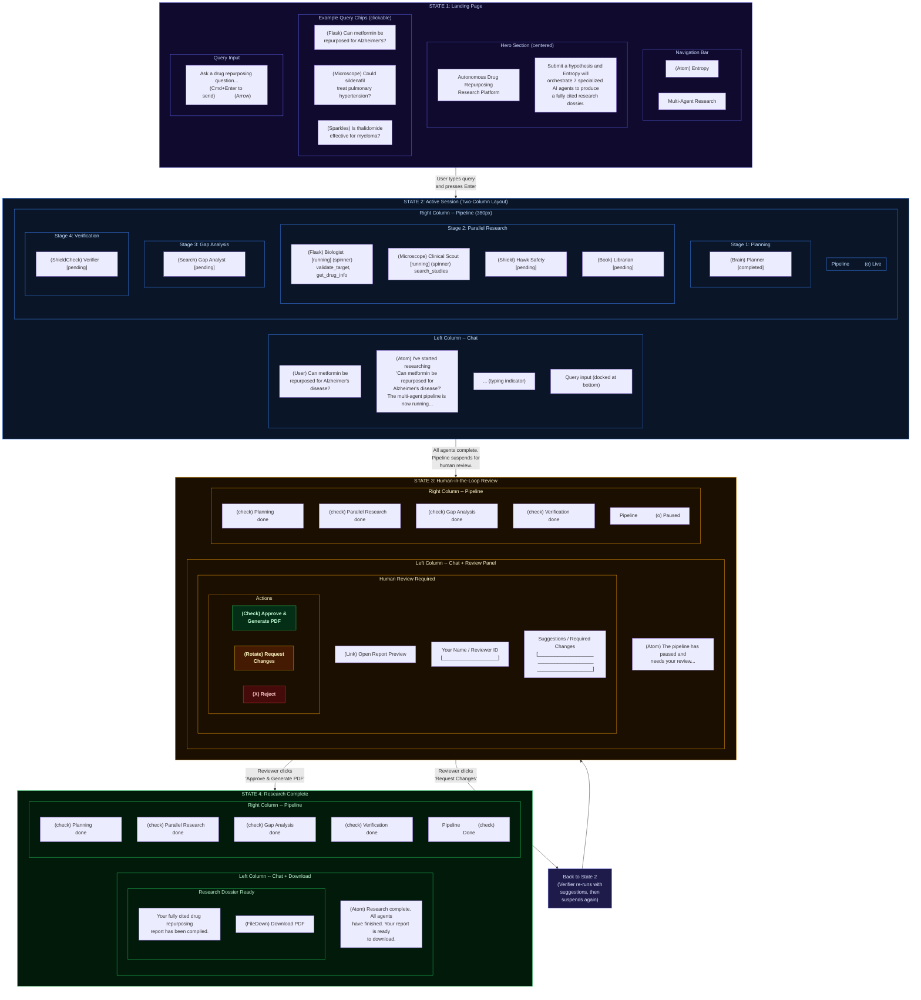

# Entropy -- System Diagrams

**Team Jigyasa** | AMD Slingshot 2026 | Open Innovation

> Three diagrams that explain the full system: what we built (Architecture), how it thinks (Pipeline Flow), and what the user sees (Wireframe / UI Flow).

---

## Table of Contents

1. [System Architecture Diagram](#1-system-architecture-diagram)
2. [Research Pipeline Flow](#2-research-pipeline-flow)
3. [Wireframe / UI Mock -- User Flow](#3-wireframe--ui-mock----user-flow)

---

## 1. System Architecture Diagram

> **What did we build, and how do all the pieces connect?**

This diagram shows the full system from the user's browser down to the external biomedical databases, including every layer in between.

```mermaid
flowchart TB
    %% ========== USER LAYER ==========
    subgraph USER_LAYER["User Layer"]
        USER["Researcher / Reviewer<br/>(Browser)"]
    end

    %% ========== FRONTEND LAYER ==========
    subgraph FRONTEND["Frontend &mdash; Next.js Copilot UI :3000"]
        direction LR
        CHAT["Chat Interface<br/>Natural language input<br/>+ assistant responses"]
        PIPELINE_PANEL["Pipeline Stages Panel<br/>Real-time agent progress<br/>+ tool call feed"]
        HITL_PANEL["HITL Review Panel<br/>Approve / Request Changes<br/>/ Reject"]
        REPORT_DL["Report Download<br/>PDF dossier"]
        COPILOT["CopilotKit Sidebar<br/>AG-UI protocol"]
    end

    %% ========== API LAYER ==========
    subgraph API_LAYER["API Layer &mdash; Hono REST Server :3001"]
        direction LR
        REST["REST Endpoints<br/>POST /research<br/>GET /research/:id<br/>GET /agents<br/>POST /review<br/>GET /report<br/>GET /preview<br/>GET /audit"]
        SSE["SSE Streaming<br/>GET /stream<br/>Real-time events"]
        CHAT_EP["/api/chat<br/>CopilotKit Runtime<br/>AG-UI Adapter"]
        SESSION_STORE["In-Memory<br/>Session Store"]
        ACTIVITY_BUS["Activity Bus<br/>(EventEmitter)"]
    end

    %% ========== ORCHESTRATION LAYER ==========
    subgraph ORCHESTRATION["Orchestration Layer &mdash; Mastra Workflow Engine"]
        direction TB

        subgraph PLANNING["Phase 1: Planning"]
            PLANNER["Planner Agent<br/>PPICO decomposition<br/>+ task distribution"]
        end

        subgraph RESEARCH["Phase 2: Parallel Research"]
            direction LR
            BIO["Biologist<br/>Agent"]
            CLIN["Clinical Scout<br/>Agent"]
            HAWK["Hawk Safety<br/>Agent"]
            LIB["Librarian<br/>Agent"]
        end

        subgraph ANALYSIS["Phase 3: Analysis"]
            direction LR
            GAP["Gap Analyst<br/>TPP checklist<br/>evaluation"]
            VERIFIER["Verifier Agent<br/>Independent<br/>fact-checker"]
        end

        subgraph GOVERNANCE["Phase 4: Governance & Output"]
            direction LR
            HITL["Human-in-the-Loop<br/>suspend / resume"]
            REPORT_GEN["Report Generator<br/>HTML render<br/>+ PDF compile"]
        end
    end

    %% ========== MCP TOOL LAYER ==========
    subgraph MCP_LAYER["Tool Layer &mdash; MCP Servers (stdio transport)"]
        direction LR
        MCP_BIO["mcp-biology<br/>13 tools"]
        MCP_CLIN["mcp-clinical<br/>7 tools"]
        MCP_SAFE["mcp-safety<br/>7 tools"]
        MCP_COMM["mcp-commercial<br/>3 tools (planned)"]
    end

    %% ========== EXTERNAL DATA LAYER ==========
    subgraph DATA_SOURCES["External Biomedical Data Sources"]
        direction LR

        subgraph BIO_DB["Biology"]
            OT["Open Targets<br/>(GraphQL)"]
            ENSEMBL["Ensembl<br/>(REST)"]
            UNIPROT["UniProt<br/>(REST)"]
            NCBI_BIO["NCBI<br/>(E-utilities)"]
        end

        subgraph CLIN_DB["Clinical"]
            CTG["ClinicalTrials.gov<br/>(REST)"]
            PUBMED["PubMed<br/>(E-utilities)"]
        end

        subgraph SAFE_DB["Safety"]
            FDA["OpenFDA FAERS<br/>(REST)"]
            RXNAV["RxNav<br/>(REST)"]
        end
    end

    %% ========== LLM PROVIDERS ==========
    subgraph LLM_PROVIDERS["LLM Providers (per-agent configurable)"]
        direction LR
        GEMINI["Google<br/>Gemini"]
        OPENAI["OpenAI<br/>GPT"]
        ANTHROPIC["Anthropic<br/>Claude"]
        PERPLEXITY["Perplexity<br/>Sonar Pro"]
    end

    %% ========== INFRASTRUCTURE ==========
    subgraph INFRA["Infrastructure"]
        direction LR
        PG["PostgreSQL<br/>Audit Trail<br/>5 tables + cache"]
        OTEL["OpenTelemetry<br/>Distributed tracing<br/>OTLP / Console"]
        PUPPETEER["Puppeteer<br/>HTML to PDF<br/>compilation"]
    end

    %% ========== CONNECTIONS ==========

    %% User <-> Frontend
    USER -->|"types query /<br/>reviews dossier"| CHAT
    USER -->|"monitors progress"| PIPELINE_PANEL
    USER -->|"approves / rejects"| HITL_PANEL
    USER -->|"downloads PDF"| REPORT_DL

    %% Frontend <-> API
    CHAT -->|"POST /research<br/>+ SSE stream"| REST
    PIPELINE_PANEL -->|"GET /agents<br/>+ SSE stream"| SSE
    HITL_PANEL -->|"POST /review"| REST
    REPORT_DL -->|"GET /report"| REST
    COPILOT -->|"/api/chat"| CHAT_EP

    %% API internal
    REST --- SESSION_STORE
    SSE --- ACTIVITY_BUS

    %% API <-> Orchestration
    REST -->|"start / resume<br/>workflow"| PLANNER
    ACTIVITY_BUS -->|"agent events<br/>tool calls"| SSE

    %% Orchestration flow
    PLANNER -->|"sub-tasks"| BIO & CLIN & HAWK & LIB
    BIO & CLIN & HAWK & LIB -->|"merged evidence"| GAP
    GAP -->|"gap report"| VERIFIER
    VERIFIER -->|"verification report"| HITL
    HITL -->|"approved"| REPORT_GEN

    %% Orchestration <-> MCP
    BIO -->|"tool calls"| MCP_BIO
    CLIN -->|"tool calls"| MCP_CLIN
    HAWK -->|"tool calls"| MCP_SAFE
    LIB -->|"tool calls"| MCP_CLIN
    VERIFIER -.->|"re-queries<br/>all tools"| MCP_BIO & MCP_CLIN & MCP_SAFE

    %% MCP <-> Data Sources
    MCP_BIO --> OT & ENSEMBL & UNIPROT & NCBI_BIO
    MCP_CLIN --> CTG & PUBMED
    MCP_SAFE --> FDA & RXNAV

    %% Orchestration <-> LLMs
    PLANNER -.->|"LLM call"| GEMINI
    BIO -.->|"LLM call"| GEMINI
    CLIN -.->|"LLM call"| GEMINI
    HAWK -.->|"LLM call"| GEMINI
    LIB -.->|"LLM call"| GEMINI
    GAP -.->|"LLM call"| GEMINI
    VERIFIER -.->|"LLM call"| OPENAI

    %% Orchestration <-> Infrastructure
    PLANNER -.-> PG
    REPORT_GEN -->|"HTML input"| PUPPETEER
    PUPPETEER -->|"PDF output"| REPORT_GEN
    ORCHESTRATION -.-> OTEL

    %% Styling
    classDef userStyle fill:#6366f1,stroke:#4f46e5,color:#fff,font-weight:bold
    classDef frontendStyle fill:#1e1b4b,stroke:#6366f1,color:#c7d2fe
    classDef apiStyle fill:#0f172a,stroke:#3b82f6,color:#93c5fd
    classDef orchStyle fill:#1a0a2e,stroke:#a855f7,color:#e9d5ff
    classDef mcpStyle fill:#0a1628,stroke:#06b6d4,color:#a5f3fc
    classDef dataStyle fill:#052e16,stroke:#22c55e,color:#bbf7d0
    classDef llmStyle fill:#2d1b0e,stroke:#f59e0b,color:#fde68a
    classDef infraStyle fill:#1c1917,stroke:#78716c,color:#d6d3d1

    class USER userStyle
    class CHAT,PIPELINE_PANEL,HITL_PANEL,REPORT_DL,COPILOT frontendStyle
    class REST,SSE,CHAT_EP,SESSION_STORE,ACTIVITY_BUS apiStyle
    class PLANNER,BIO,CLIN,HAWK,LIB,GAP,VERIFIER,HITL,REPORT_GEN orchStyle
    class MCP_BIO,MCP_CLIN,MCP_SAFE,MCP_COMM mcpStyle
    class OT,ENSEMBL,UNIPROT,NCBI_BIO,CTG,PUBMED,FDA,RXNAV dataStyle
    class GEMINI,OPENAI,ANTHROPIC,PERPLEXITY llmStyle
    class PG,OTEL,PUPPETEER infraStyle
```

### Architecture -- Layer Breakdown

| Layer              | What It Does                                                                      | Key Tech                                                                         |
| ------------------ | --------------------------------------------------------------------------------- | -------------------------------------------------------------------------------- |
| **User Layer**     | Researcher types a drug repurposing hypothesis and reviews the output             | Browser                                                                          |
| **Frontend**       | Chat interface + real-time pipeline monitor + HITL review panel + PDF download    | Next.js 16, React 19, CopilotKit, AG-UI                                          |
| **API**            | REST endpoints, SSE streaming, session management, workflow orchestration bridge  | Hono, EventEmitter, Server-Sent Events                                           |
| **Orchestration**  | 7 AI agents in a structured pipeline with parallel execution and human governance | Mastra, Vercel AI SDK, Zod                                                       |
| **Tool Layer**     | 4 MCP servers (30+ tools) translating agent requests into real database API calls | Model Context Protocol (stdio)                                                   |
| **Data Sources**   | 8 real-world biomedical databases queried live                                    | Open Targets, ClinicalTrials.gov, OpenFDA, PubMed, UniProt, Ensembl, NCBI, RxNav |
| **LLM Providers**  | Multi-provider AI models, configurable per agent                                  | Gemini, OpenAI, Anthropic, Perplexity                                            |
| **Infrastructure** | Audit trail, distributed tracing, PDF compilation                                 | PostgreSQL, OpenTelemetry, Puppeteer                                             |

---

## 2. Research Pipeline Flow

> **How does the system think? What happens after you submit a query?**

This diagram shows the exact 9-step research pipeline, including parallel execution, the HITL review loop (with iteration), and report generation.

```mermaid
flowchart LR
    %% ========== INPUT ==========
    QUERY["Research Query<br/><i>'Can Metformin be repurposed<br/>for Alzheimer's disease?'</i>"]

    %% ========== STEP 1: AUDIT ==========
    AUDIT["1. Audit Session<br/>Create session record<br/>Assign session ID<br/>Mark status: running"]

    %% ========== STEP 2: PLANNER ==========
    PLANNER["2. Planner Agent<br/>━━━━━━━━━━━━━━━━<br/>Decompose into PPICO:<br/>- Population<br/>- Prognostic Factors<br/>- Intervention<br/>- Comparison<br/>- Outcome<br/>━━━━━━━━━━━━━━━━<br/>Generate sub-tasks<br/>with priorities &<br/>dependencies"]

    %% ========== STEP 3: PARALLEL RESEARCH ==========
    subgraph PARALLEL["3. Parallel Evidence Gathering (4 agents simultaneously)"]
        direction TB

        BIO["Biologist<br/>━━━━━━━━━━━━<br/>Open Targets<br/>UniProt<br/>Ensembl<br/>NCBI<br/>━━━━━━━━━━━━<br/>Target validation<br/>Gene-disease links<br/>Protein pathways"]

        CLIN["Clinical Scout<br/>━━━━━━━━━━━━<br/>ClinicalTrials.gov<br/>PubMed<br/>━━━━━━━━━━━━<br/>Trial landscape<br/>Study designs<br/>Endpoints & results"]

        HAWK["Hawk Safety<br/>━━━━━━━━━━━━<br/>OpenFDA FAERS<br/>RxNav<br/>Drug Labels<br/>━━━━━━━━━━━━<br/>Adverse events<br/>Drug interactions<br/>Recalls & alerts"]

        LIB["Librarian<br/>━━━━━━━━━━━━<br/>PubMed<br/>NCBI<br/>Preprints<br/>━━━━━━━━━━━━<br/>Published studies<br/>Systematic reviews<br/>Meta-analyses"]
    end

    %% ========== STEP 4: MERGE ==========
    MERGE["4. Merge Evidence<br/>━━━━━━━━━━━━━━━━<br/>Combine all agent<br/>outputs into unified<br/>Zod-validated schema<br/>━━━━━━━━━━━━━━━━<br/>Sanitize raw output<br/>Log agent traces"]

    %% ========== STEP 5: GAP ANALYST ==========
    GAP["5. Gap Analyst<br/>━━━━━━━━━━━━━━━━<br/>Evaluate against<br/>12-item TPP checklist:<br/>- Mechanism of Action<br/>- Target Validation<br/>- Preclinical Efficacy<br/>- Clinical Efficacy<br/>- Safety Profile<br/>- Drug Interactions<br/>- Chronic Toxicity<br/>- PK / Dosing<br/>- Patient Population<br/>- Regulatory Pathway<br/>- Competitive Landscape<br/>- Literature Support<br/>━━━━━━━━━━━━━━━━<br/>Classify gaps:<br/>Critical / Major / Minor<br/>Flag contradictions<br/>Readiness verdict"]

    %% ========== STEP 6: VERIFIER ==========
    VERIFIER["6. Verifier Agent<br/>━━━━━━━━━━━━━━━━<br/>Re-queries ALL raw<br/>data sources (30+ tools)<br/>━━━━━━━━━━━━━━━━<br/>Confidence score 0-1<br/>per claim<br/>Confirmed / Flagged /<br/>Unverifiable<br/>Overall integrity:<br/>High / Medium / Low"]

    %% ========== STEP 7: HTML PREVIEW ==========
    PREVIEW["7. Render HTML<br/>Preview<br/>━━━━━━━━━━━━━━━━<br/>Self-contained dossier<br/>with all sections<br/>for reviewer to inspect"]

    %% ========== STEP 8: HITL ==========
    HITL{"8. Human Review<br/>(Pipeline Suspends)<br/>━━━━━━━━━━━━━━━━<br/>Reviewer sees:<br/>- Full HTML dossier<br/>- Gap analysis<br/>- Verification report"}

    %% ========== HITL DECISIONS ==========
    APPROVE["Approved"]
    CHANGES["Request<br/>Changes"]
    REJECT["Rejected"]

    %% ========== STEP 9: REPORT ==========
    REPORT["9. Generate Report<br/>━━━━━━━━━━━━━━━━<br/>Final HTML render<br/>+ Puppeteer PDF<br/>compilation<br/>━━━━━━━━━━━━━━━━<br/>A4 format<br/>Headers & footers<br/>Page numbers<br/>Full citations"]

    %% ========== OUTPUT ==========
    OUTPUT["Research Dossier<br/>(PDF)<br/>━━━━━━━━━━━━━━━━<br/>Executive Summary<br/>PPICO Breakdown<br/>Biological Rationale<br/>Clinical Landscape<br/>Safety Profile<br/>Literature Review<br/>Gap Analysis<br/>Verification Report<br/>Reviewer Decision<br/>Appendices"]

    DONE["Pipeline Complete<br/>Status: completed<br/>Audit trail saved"]

    %% ========== CONNECTIONS ==========
    QUERY --> AUDIT --> PLANNER
    PLANNER -->|"sub-tasks<br/>distributed"| PARALLEL
    BIO & CLIN & HAWK & LIB --> MERGE
    MERGE --> GAP
    GAP --> VERIFIER
    VERIFIER --> PREVIEW --> HITL

    HITL -->|"Approve"| APPROVE --> REPORT
    HITL -->|"Request Changes<br/>(+ suggestions)"| CHANGES
    HITL -->|"Reject"| REJECT

    CHANGES -->|"Re-run verifier<br/>with suggestions<br/>as context"| VERIFIER

    REJECT -->|"Pipeline ends<br/>Status: completed<br/>Decision: rejected"| DONE

    REPORT --> OUTPUT --> DONE

    %% ========== STYLING ==========
    classDef inputStyle fill:#6366f1,stroke:#4f46e5,color:#fff,font-weight:bold
    classDef stepStyle fill:#1e1b4b,stroke:#818cf8,color:#e0e7ff
    classDef parallelStyle fill:#0a1628,stroke:#06b6d4,color:#a5f3fc
    classDef analysisStyle fill:#2d0a4e,stroke:#a855f7,color:#e9d5ff
    classDef hitlStyle fill:#451a03,stroke:#f59e0b,color:#fef3c7,font-weight:bold
    classDef approveStyle fill:#052e16,stroke:#22c55e,color:#bbf7d0,font-weight:bold
    classDef rejectStyle fill:#450a0a,stroke:#ef4444,color:#fecaca,font-weight:bold
    classDef changesStyle fill:#451a03,stroke:#eab308,color:#fef9c3
    classDef outputStyle fill:#0c4a6e,stroke:#0ea5e9,color:#e0f2fe,font-weight:bold
    classDef doneStyle fill:#052e16,stroke:#22c55e,color:#bbf7d0

    class QUERY inputStyle
    class AUDIT,PLANNER,MERGE,PREVIEW stepStyle
    class BIO,CLIN,HAWK,LIB parallelStyle
    class GAP,VERIFIER analysisStyle
    class HITL hitlStyle
    class APPROVE,REPORT approveStyle
    class REJECT rejectStyle
    class CHANGES changesStyle
    class OUTPUT outputStyle
    class DONE doneStyle
```

### Pipeline -- Step Summary

| Step | Agent / Action        | Input                           | Output                                                  | Duration       |
| ---- | --------------------- | ------------------------------- | ------------------------------------------------------- | -------------- |
| 1    | **Audit Session**     | Query string                    | Session ID, audit record                                | Instant        |
| 2    | **Planner**           | Research query                  | PPICO breakdown + prioritized sub-tasks                 | ~10s           |
| 3    | **4 Parallel Agents** | Agent-specific sub-tasks        | Domain evidence (biology, clinical, safety, literature) | ~30-60s        |
| 4    | **Merge Evidence**    | 4 agent outputs                 | Unified evidence schema                                 | Instant        |
| 5    | **Gap Analyst**       | Merged evidence + TPP checklist | Gap report with severity ratings + readiness verdict    | ~15s           |
| 6    | **Verifier**          | Evidence + gap report           | Claim-by-claim verification with confidence scores      | ~30s           |
| 7    | **Render Preview**    | All pipeline data               | Self-contained HTML dossier                             | ~2s            |
| 8    | **Human Review**      | HTML preview                    | Approve / Request Changes / Reject                      | Human decision |
| 9    | **Generate Report**   | Final HTML                      | PDF dossier (A4, paginated, cited)                      | ~5s            |

**Total estimated time: ~2-5 minutes** (vs. weeks/months manually)

---

## 3. Wireframe / UI Mock -- User Flow

> **What does the user actually see? What's the experience from start to finish?**

This diagram shows the four main UI states and how the user transitions between them.

### UI Flow -- State Transitions

| From               | Trigger                                    | To                                                         |
| ------------------ | ------------------------------------------ | ---------------------------------------------------------- |
| **Landing Page**   | User submits a research query              | **Active Session**                                         |
| **Active Session** | All agents complete, pipeline suspends     | **HITL Review**                                            |
| **HITL Review**    | Reviewer clicks "Approve & Generate PDF"   | **Completed**                                              |
| **HITL Review**    | Reviewer clicks "Request Changes"          | **Active Session** (verifier re-runs, then suspends again) |
| **HITL Review**    | Reviewer clicks "Reject"                   | **Completed** (with rejection status)                      |
| **Completed**      | User clicks "New Query" (top-right button) | **Landing Page**                                           |

### What the Reviewer Sees During HITL

Before making a decision, the reviewer can click **"Open Report Preview"** to view the full HTML dossier in a new tab. This dossier contains:

| Section                  | Content                                                                                                                     |
| ------------------------ | --------------------------------------------------------------------------------------------------------------------------- |
| **Executive Summary**    | High-level assessment with verification + gap analysis summaries                                                            |
| **PPICO Breakdown**      | Structured table of the decomposed hypothesis                                                                               |
| **Biological Rationale** | Biologist agent's findings on molecular targets and pathways                                                                |
| **Clinical Landscape**   | Clinical Scout's trial landscape analysis                                                                                   |
| **Safety Profile**       | Hawk's pharmacovigilance assessment                                                                                         |
| **Literature Review**    | Librarian's survey of published evidence                                                                                    |
| **Gap Analysis**         | TPP checklist table (complete/partial/missing) + present/missing evidence + contradictions + risk flags + readiness verdict |
| **Verification Report**  | Claims table (confirmed/flagged/unverifiable) + confidence scores + overall integrity rating                                |

This ensures the human reviewer has **full visibility** into all evidence before approving, requesting changes, or rejecting the dossier.

---

<b>Team Jigyasa</b> | AMD Slingshot 2026 | Open Innovation

